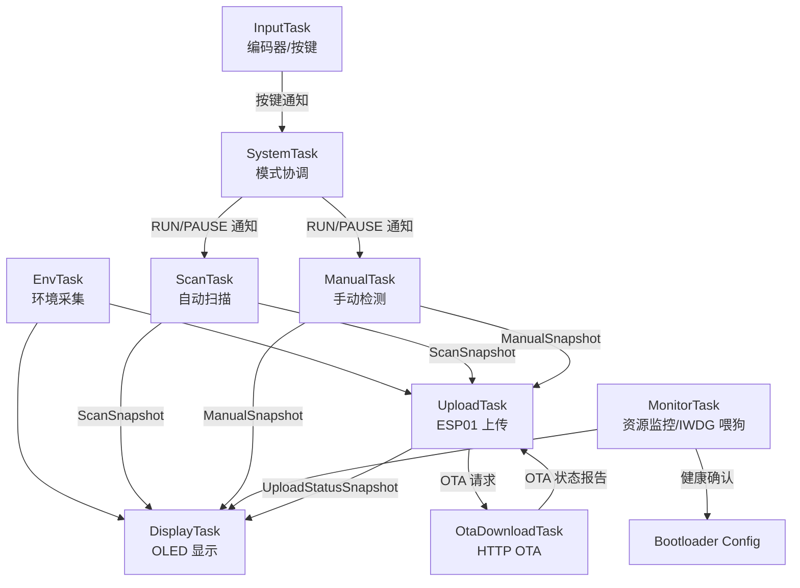

# STM32_Monitor

基于 STM32F103ZE 与 FreeRTOS 的多传感器环境监测与人员检测系统。

项目在 STM32F103ZE 开发板上集成 DHT11、光敏传感器、HC-SR04、AMG8833、OLED、舵机、旋转编码器和 ESP01，实现环境采集、自动扫描、手动方向检测、OLED 显示、Wi-Fi/TCP 上传和任务资源监控。

接入 Bootloader/OTA A/B 双槽能力：Keil 工程包含 `Monitor Slot A` / `Monitor Slot B` 构建目标；应用可通过 ESP01 接收 PC 端服务程序下发的 `PATH/VER` OTA 命令，并下载固件到非活动槽位。新固件启动后，`MonitorTask` 基于关键任务心跳完成健康确认。

## 功能概览

- AutoScan 模式：舵机按多个角度自动扫描，采集距离和热阵列摘要，输出多点检测结果。
- Manual 模式：旋转编码器控制舵机角度，按当前方向采集距离、热阵列和人员检测结果。
- OLED 显示：支持自动扫描页、手动页、上传状态页和任务监控页。
- ESP01 上传：通过 Wi-Fi/TCP 上传环境数据、当前模式、检测结果和上传状态。
- 应用侧 OTA：服务程序可通过上传响应下发 OTA 请求，`OtaDownloadTask` 独占 ESP01 执行 HTTP 下载。
- OTA 状态报告：上传报文包含 Bootloader Config、A/B 版本、最近一次 OTA 结果和失败原因。
- ESP01 接收路径优化：USART3 使用 DMA 环形缓冲区和 IDLE 中断承接串口字节，经 RingBuffer 交由 AT 解析流程处理；已完成原接线下业务任务共存和压力回归。
- FreeRTOS 多任务：拆分输入、模式协调、扫描、手动控制、环境采集、显示、上传和监控任务。
- 运行监控：输出任务心跳、栈余量、堆水位，并通过 IWDG 提供异常复位恢复能力。
- 低活动策略：OLED 长时间无输入时降低刷新频率，ESP01 网络异常时进行退避重连。

## 硬件模块

| 模块 | 用途 |
| --- | --- |
| STM32F103ZE | 主控，运行 FreeRTOS 多任务程序 |
| DHT11 | 温湿度采集 |
| 光敏传感器 | 环境光状态采集 |
| HC-SR04 | 距离检测 |
| AMG8833 | 8x8 热阵列检测辅助 |
| OLED | 本地数据显示 |
| 舵机 | 自动扫描和手动方向控制 |
| 旋转编码器 | 页面切换、模式切换和手动角度控制 |
| ESP01 | Wi-Fi/TCP 上传下载 |

## 软件架构

系统采用 `SystemTask` 负责模式协调，各业务任务拥有自己的数据，并通过快照队列提供给显示和上传任务。



核心设计点：

- `SystemTask` 只负责运行模式、命令下发、ACK 等待和运行态发布。
- Scan/Manual/Monitor 大结构快照采用生产者静态双缓冲和 `const` 指针队列。
- `DisplayTask` 读取最新快照用于页面刷新。
- `UploadTask` 读取快照后复制到本地副本，再进行协议打包和 ESP01 发送。
- `UploadTask` 和 `OtaDownloadTask` 通过 ESP01 互斥锁隔离，避免上传和 OTA 下载同时占用 AT 链路。
- `MonitorTask` 在新固件启动并通过任务健康检查后写入 `CONFIRMED`，完成 A/B OTA 健康确认。
- OLED 与 AMG8833 共享 I2C，通过互斥锁和 BSP 超时恢复保护总线访问。
- IWDG 由 `MonitorTask` 集中喂狗，关键任务心跳异常时停止喂狗并等待复位恢复。

## 目录结构

```text
STM32_Monitor/
├── App/          应用层任务、显示、上传、检测、扫描和协议封装
├── BSP/          STM32 外设基础封装，如 GPIO、USART、I2C、PWM、IWDG
├── Drivers/      传感器和模块驱动，如 OLED、DHT11、AMG8833、ESP01
├── System/       延时等系统辅助模块
├── User/         main、异常中断和 STM32 标准库配置
├── Library/      STM32 标准外设库
├── Include/      CMSIS 头文件
├── Middlewares/  FreeRTOS 源码
├── Start/        启动文件
├── DebugConfig/  Keil 调试配置
├── Tools/        固件打包、OTA 触发和串口 IAP 辅助脚本
└── project.uvprojx
```

## 构建与下载

项目以 Keil 工程作为正式构建入口，当前包含三个 target：

| Target | 用途 | App 基址 |
| --- | --- | --- |
| `Target 1` | 原始单 App 调试目标 | `0x08000000` |
| `Monitor Slot A` | Bootloader A/B Slot A App | `0x08008000` |
| `Monitor Slot B` | Bootloader A/B Slot B App | `0x08038000` |

1. 使用 Keil MDK 打开 `project.uvprojx`。
2. 选择需要构建的 target。
3. 编译工程。
4. 通过 ST-Link 下载到开发板。
5. 使用 USART1 查看运行日志。

Slot A/B 构建后可使用工具脚本生成 OTA 包：

```powershell
python .\Tools\firmware_pack.py --slot a --version 11 .\Objects\SlotA\monitor_slot_a.bin .\Objects\monitor_slot_a_full_v11.pkg
python .\Tools\firmware_pack.py --slot b --version 12 .\Objects\SlotB\monitor_slot_b.bin .\Objects\monitor_slot_b_full_v12.pkg
```

上传功能依赖本地 Wi-Fi/TCP 配置。上板前需要修改：

```c
// App/app_upload_config.h
#define APP_UPLOAD_WIFI_SSID                 "YOUR_WIFI_SSID"
#define APP_UPLOAD_WIFI_PASSWORD             "YOUR_WIFI_PASSWORD"
#define APP_UPLOAD_TCP_HOST                  "192.168.x.x"
#define APP_UPLOAD_TCP_PORT                  8080
```

## 公开文档

- [项目概览](docs/public/项目概览.md)
- [软件架构与任务划分](docs/public/软件架构与任务划分.md)
- [数据结构与快照说明](docs/public/数据结构与快照说明.md)
- [构建与配置说明](docs/public/构建与配置说明.md)
- [硬件连接与引脚分配](docs/public/硬件连接与引脚分配.md)
- [状态码与错误处理](docs/public/状态码与错误处理.md)
- [硬件参考资料压缩包](docs/reference.zip)
