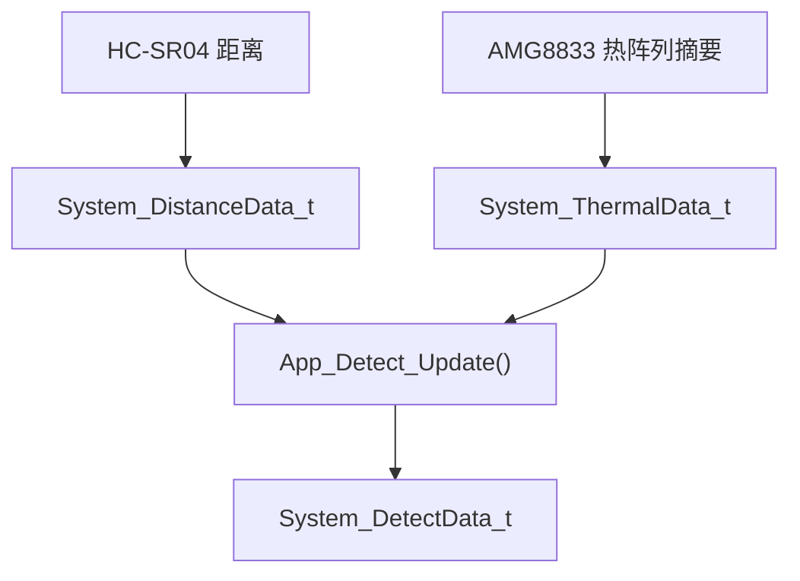
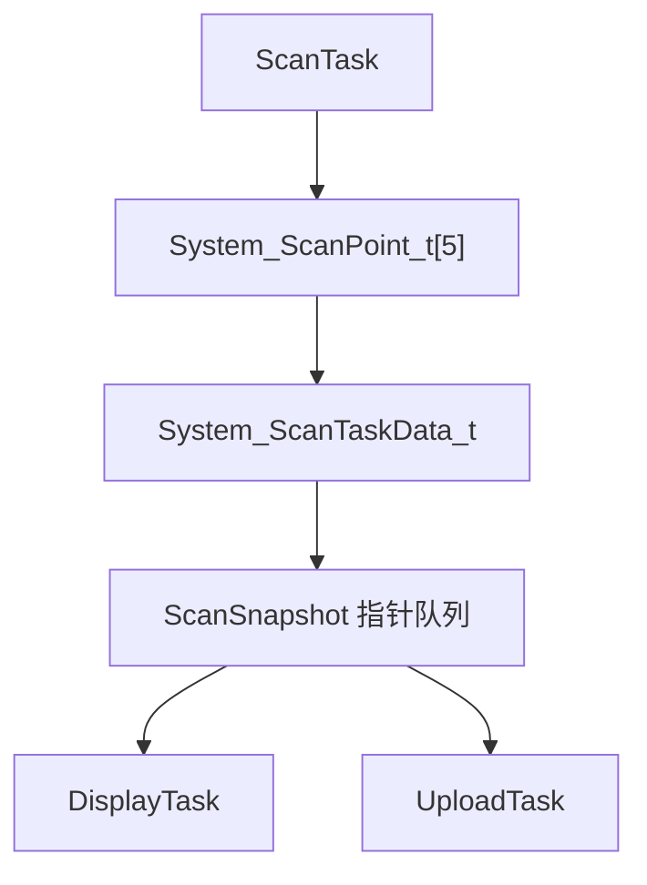
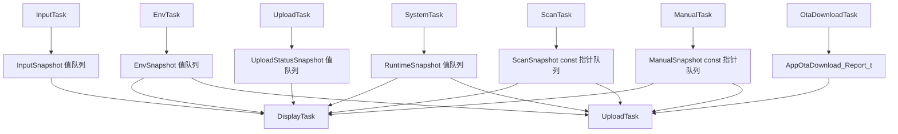

# 数据结构与快照说明

项目的跨模块共享数据结构主要定义在 `Middlewares/system_data.h`；OTA 状态报告结构定义在 `App/app_ota_download.h`。

- 统一传感器、舵机、输入、上传、OTA 状态报告和运行态数据格式。
- 让任务之间通过队列传递最新快照，而不是直接共享可变数据。
- 在数据结构中保留 `valid` 和状态码字段，便于显示、上传和日志判断数据是否可信。

## 数据分组

这些数据结构可以按用途分为七类：

| 分组 | 代表结构体 | 说明 |
| --- | --- | --- |
| 基础采集数据 | `System_EnvData_t`、`System_DistanceData_t`、`System_ThermalData_t`、`System_DetectData_t` | 封装环境、距离、热阵列和检测结果。 |
| 舵机与扫描点 | `System_ServoData_t`、`System_ScanPoint_t` | 记录舵机角度和单个扫描角度的数据快照。 |
| 任务输出快照 | `System_EnvTaskData_t`、`System_ScanTaskData_t`、`System_ManualTaskData_t` | Env、Scan、Manual 任务向外发布的数据。 |
| 输入与运行态 | `System_InputTaskData_t`、`System_RuntimeData_t`、`SystemTask_Data_t` | 编码器输入、系统模式和模式变化状态。 |
| 上传状态 | `System_UploadStatus_t`、`UploadStatus_t` | Wi-Fi/TCP 连接状态、最近上传结果和计数。 |
| 传感器状态 | `System_EnvSensorStatus_t`、`System_DirectionSensorStatus_t`、`System_SensorStatus_t` | 保存最近一次传感器读取状态码。 |
| OTA 状态报告 | `AppOtaDownload_Report_t` | 保存 Bootloader Config 摘要、最近一次 OTA 请求、下载结果和包头摘要。 |

## 基础采集数据

### 环境数据

`System_EnvData_t` 聚合环境类传感器：

- `DHT11_Data_t dht11_data`
- `LightSensor_Data_t lightsensor_data`

它对应 `EnvTask` 周期采集的温湿度和光照状态。

### 当前方向数据

当前方向检测由三类结构描述：

- `System_DistanceData_t`：保存 HC-SR04 最近一次距离结果。
- `System_ThermalData_t`：保存 AMG8833 最近一次热阵列摘要。
- `System_DetectData_t`：保存当前方向是否检出目标。

其中 `System_DetectData_t.human_detected` 由 App 层根据距离和热阵列摘要规则计算。

## 自动扫描数据

自动扫描模式下，舵机会在多个固定角度采集方向数据。当前扫描点数量由 `SYSTEM_SCAN_POINT_COUNT` 定义，值为 `5`。

### 单点快照

`System_ScanPoint_t` 表示一个角度点的快照：

- `point_angle`：该点对应舵机角度。
- `point_distance`：该角度下的距离数据。
- `point_thermal`：该角度下的热阵列摘要。
- `point_detected`：该角度下的检测结果。
- `point_valid`：该点是否有效。

### 扫描任务快照

`System_ScanTaskData_t` 表示一次自动扫描任务对外发布的数据：

- `points[SYSTEM_SCAN_POINT_COUNT]`：多个角度点。
- `servo`：当前舵机状态。
- `detect`：多角度汇总检测结果。
- `direction_sensor_status`：方向类传感器最近一次状态。
- `valid`：是否至少存在一个有效扫描点。

## 手动控制数据

手动模式下，编码器控制舵机角度，系统只采集当前方向的数据。

`System_ManualTaskData_t` 包含：

- `servo`：当前舵机数据。
- `distance`：当前方向距离。
- `thermal`：当前方向热阵列摘要。
- `detect`：当前方向检测结果。
- `direction_sensor_status`：方向类传感器状态。
- `valid`：当前手动数据是否有效。

它和自动扫描快照的区别是：自动扫描保存多个角度点，手动模式只保存当前角度的一组数据。

## 环境任务数据

`System_EnvTaskData_t` 是 `EnvTask` 对外发布的环境快照：

- `env_data`：DHT11 和光敏模块数据。
- `env_sensor_status`：环境类传感器状态。
- `valid`：环境数据是否有效。

当前 `valid` 的含义是 DHT11 或光敏模块至少有一项数据有效。

## 输入与运行态数据

### 输入任务数据

`System_InputTaskData_t` 保存编码器输入：

- `encoder_data`：本轮编码器增量、按下状态和点击事件。
- `encoder_total`：InputTask 启动后的累计旋转量。
- `encoder_status`：最近一次编码器驱动状态。
- `valid`：输入数据是否有效。

其中 `encoder_total` 用于消费者按差值恢复完整输入，避免只读取瞬时增量时漏掉中间变化。

### 运行态数据

`System_RuntimeData_t` 保存系统模式和最近状态：

- `mode`：当前系统模式，支持 AutoScan 和 Manual。
- `mode_valid`：模式状态是否有效。
- `mode_changed`：本次发布是否发生模式切换。
- `last_systemstatus`：最近一次系统状态。

`SystemTask_Data_t` 当前只包含 `runtime`，用于表达 `SystemTask` 对外发布的运行态。

## 上传状态数据

`System_UploadStatus_t` 由上传链路维护：

- `wifi_connected`：Wi-Fi 连接状态。
- `tcp_connected`：TCP 连接状态。
- `last_upload_status`：最近一次上传结果。
- `upload_count`：上传成功次数。
- `upload_fail_count`：上传失败次数。

这些数据会被 `DisplayTask` 用于上传状态页，也会被上传任务自身用于重连和状态记录。

## OTA 状态报告数据

`AppOtaDownload_Report_t` 由应用侧 OTA 下载模块维护，`UploadTask` 在打包上传报文时读取该快照：

- `cfg_valid`、`cfg_state`：Bootloader Config 是否可读，以及当前升级状态。
- `confirmed_slot`、`pending_slot`、`boot_slot`：当前已确认槽、待验证槽和本次启动槽。
- `slot_a_version`、`slot_b_version`：A/B 槽固件版本摘要。
- `result`、`status`：最近一次健康确认、下载中、等待复位或失败原因。
- `target_slot`、`http_path`、`expected_version`：最近一次 OTA 请求的目标和服务器下发参数。
- `package_version`、`image_size`、`image_crc32`：最近一次下载包头摘要。

这些字段会被 `App_Protocol_BuildUploadString()` 转换为 `OTA_STATE`、`OTA_CONFIRMED`、`OTA_PENDING`、`OTA_BOOT`、`OTA_LAST`、`OTA_DL_STATUS`、`OTA_PATH` 等轻量键值字段，供 PC 端服务程序判断升级闭环结果。

## 快照传递方式

项目采用“最新值快照”而不是历史消息流。队列通常只保留最新状态，消费者读取最新快照即可。

| 快照 | 数据结构 | 传递方式 | 主要消费者 |
| --- | --- | --- | --- |
| EnvSnapshot | `System_EnvTaskData_t` | 值队列 | `DisplayTask`、`UploadTask` |
| InputSnapshot | `System_InputTaskData_t` | 值队列 | `SystemTask`、`DisplayTask` |
| RuntimeSnapshot | `System_RuntimeData_t` | 值队列 | `DisplayTask`、`UploadTask` |
| UploadStatusSnapshot | `System_UploadStatus_t` | 值队列 | `DisplayTask` |
| OTA 状态报告 | `AppOtaDownload_Report_t` | 模块内快照 | `UploadTask` |
| ScanSnapshot | `System_ScanTaskData_t` | `const` 指针队列 | `DisplayTask`、`UploadTask` |
| ManualSnapshot | `System_ManualTaskData_t` | `const` 指针队列 | `DisplayTask`、`UploadTask` |

较小的数据结构直接传值；较大的 Scan/Manual 快照由生产者静态缓冲持有，队列中传递 `const` 指针。

