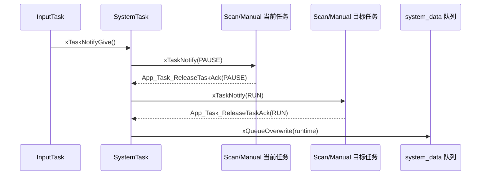
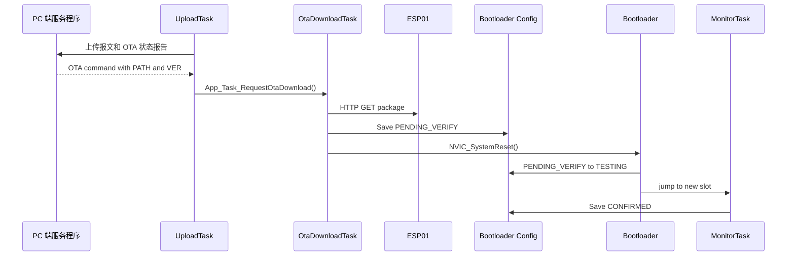
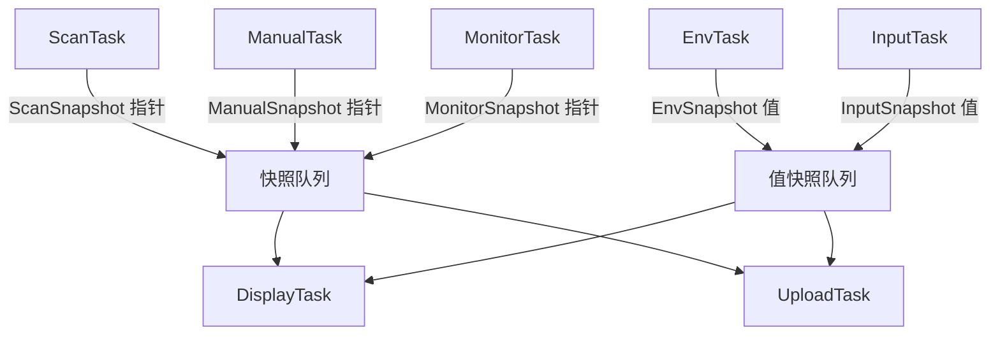

# 软件架构与任务划分

## 架构目标

项目从单一主循环拆分为 FreeRTOS 多任务结构，目标是让输入、模式协调、扫描、显示、上传、应用侧 OTA 下载和运行监控各自独立运行，避免所有逻辑重新堆回一个“大循环”。

当前架构采用：

- `SystemTask` 负责运行模式协调。
- 业务任务各自生产数据。
- 显示和上传任务读取最新快照。
- I2C 等共享外设通过互斥锁保护。
- ESP01 上传和 OTA 下载通过同一把 ESP01 互斥锁串行化，避免 AT 链路并发访问。
- `MonitorTask` 统一监控任务健康状态，并集中喂 IWDG。
- Bootloader/OTA 集成通过 Slot A/B 构建目标、Bootloader Config 和健康确认形成闭环。

## 任务总览

| 任务 | 主要职责 | 关键通信 |
| --- | --- | --- |
| `SystemTask` | Auto/Manual 模式协调、RUN/PAUSE 命令、ACK 等待、运行态发布 | 任务通知、ACK 队列、运行态队列 |
| `InputTask` | 旋转编码器和按键采集，记录最近一次输入活动 | InputSnapshot、按键通知 |
| `ScanTask` | 自动扫描、距离采集、热阵列采集和多点检测 | ScanSnapshot 指针队列 |
| `ManualTask` | 手动角度控制、当前方向采集和检测 | ManualSnapshot 指针队列 |
| `EnvTask` | DHT11 温湿度和光敏状态采集 | EnvSnapshot 队列 |
| `DisplayTask` | OLED 初始化、页面切换、数据显示和空闲降刷新 | 读取各类快照，使用 I2C mutex |
| `UploadTask` | ESP01 初始化、Wi-Fi/TCP 重连、报文构建、发送和服务端 OTA 命令解析 | 读取快照，发布 UploadStatusSnapshot，投递 OTA 请求 |
| `OtaDownloadTask` | 等待 OTA 请求，独占 ESP01，HTTP 下载固件包到非活动槽位 | OtaRequest 队列、ESP01 互斥锁、Bootloader Config |
| `MonitorTask` | 任务心跳、栈水位、堆水位、IWDG 集中喂狗和 OTA 健康确认 | MonitorSnapshot 指针队列、Bootloader Config |

## 任务创建与优先级

任务在 `User/main.c` 中创建，当前优先级按控制响应和业务重要性分配：

| 任务 | 栈大小 words | 优先级 | 说明 |
| --- | ---: | ---: | --- |
| `SystemTask` | 256 | 4 | 模式协调核心任务，优先级最高。 |
| `InputTask` | 256 | 3 | 编码器和按键输入，保证交互响应。 |
| `ScanTask` | 512 | 2 | AutoScan 核心业务任务。 |
| `ManualTask` | 384 | 2 | Manual 核心业务任务。 |
| `DisplayTask` | 384 | 1 | OLED 显示刷新。 |
| `UploadTask` | 384 | 1 | ESP01 上传和重连。 |
| `OtaDownloadTask` | 512 | 2 | OTA 下载、Flash 写入和 pending 保存。 |
| `MonitorTask` | 384 | 1 | 运行资源监控和 IWDG 喂狗。 |
| `EnvTask` | 256 | 1 | 环境数据周期采集。 |

启动阶段会先初始化 USART1 日志、读取复位原因、初始化 IWDG，再创建 FreeRTOS 队列和任务，最后调用 `vTaskStartScheduler()`。

## 模式切换机制

系统支持 AutoScan 和 Manual 两种运行模式。模式切换由 `SystemTask` 统一协调：

1. `InputTask` 检测编码器按键事件。
2. `InputTask` 通过任务通知唤醒 `SystemTask`。
3. `SystemTask` 根据当前模式决定目标模式。
4. `SystemTask` 向 `ScanTask` 或 `ManualTask` 下发 RUN/PAUSE 命令。
5. 目标任务在安全点处理命令并发布 ACK。
6. `SystemTask` 收到 ACK 后更新运行态快照。

这种方式避免外部任务直接 suspend/resume 业务任务，让 `ScanTask` 和 `ManualTask` 在自身循环安全点释放资源并切换状态。

## 快照数据流

项目的数据流采用“最新值快照”模型，而不是历史消息流。

基础规则：

- 队列长度为 1。
- 生产者用 `xQueueOverwrite()` 发布最新值。
- 消费者用 `xQueuePeek()` 读取，不移除队列内容。
- 多个消费者可以读取同一份最新数据。

当前快照分为两类：

| 快照                             | 发布方式 | 所有权                        |
| --- | --- | --- |
| `SystemTask_Data_t`              | 值拷贝   | SystemTask 生成，队列保存副本 |
| `AppTask_EnvSnapshot_t`          | 值拷贝   | EnvTask 生成，队列保存副本    |
| `AppTask_InputSnapshot_t`        | 值拷贝   | InputTask 生成，队列保存副本  |
| `AppTask_UploadStatusSnapshot_t` | 值拷贝   | UploadTask 生成，队列保存副本 |
| `AppTask_ScanSnapshot_t`         | 指针     | ScanTask 静态双缓冲拥有       |
| `AppTask_ManualSnapshot_t`       | 指针     | ManualTask 静态双缓冲拥有     |
| `AppTask_MonitorSnapshot_t`      | 指针     | MonitorTask 静态双缓冲拥有    |

`DisplayTask` 直接读取最新快照用于页面刷新。`UploadTask` 读取 Scan/Manual 指针快照后，会复制到本地静态副本，再进行协议打包和 ESP01 发送，以保证单条上传报文内部数据一致。

## Bootloader/OTA 集成

`STM32_Monitor` 通过两个 Keil 构建目标接入 Bootloader A/B 分区：

- `Monitor Slot A` 链接到 `0x08008000`。
- `Monitor Slot B` 链接到 `0x08038000`。
- `User/main.c` 根据 `APP_VECTOR_BASE_ADDR` 设置 `SCB->VTOR`。
- `OtaDownloadTask` 只在 Config 为 `CONFIRMED` 时接受新下载请求。
- `MonitorTask` 在任务健康后调用确认逻辑，把 `TESTING` 推进为 `CONFIRMED`。

应用侧 OTA 数据流：

## 共享资源保护

OLED 和 AMG8833 共用 I2C1，因此访问 I2C 总线前需要经过任务层互斥锁：

- `App_Task_TakeI2C()`
- `App_Task_GiveI2C()`

`DisplayTask` 刷新 OLED 时持有 I2C 互斥锁。`ScanTask`、`ManualTask` 通过传感器应用层读取 AMG8833 时也会使用同一把互斥锁，避免两个任务交错发起 I2C 事务。

BSP I2C 层还保留超时检测和软恢复逻辑，用于在 ACK 失败、BUSY 异常或其他 I2C 状态异常时尽量恢复总线。

除共享外设互斥外，项目也使用本地副本和临时缓冲来保证跨任务数据访问稳定：

- `ScanTask`、`ManualTask`、`MonitorTask` 使用静态双缓冲保存指针快照，消费者只读取 `const` 指针，不修改、不释放生产者持有的数据。
- `UploadTask` 读取 Scan/Manual 指针快照后，会在短临界区内复制到 `upload_scan_copy` 或 `upload_manual_copy`，协议打包和 ESP01 发送阶段只使用本地副本，避免单条上传报文内部数据被生产者更新打断。
- `UploadTask` 和 `OtaDownloadTask` 通过 ESP01 互斥锁串行访问 ESP01，上传周期如果发现 ESP01 正被 OTA 占用，会跳过本轮上传并等待下一个周期。
- `App_Upload_Send()` 使用 768 字节静态 `upload_buffer` 作为协议组包缓冲，避免在上传任务栈上反复分配较大的字符串缓存。
- USART3 接收路径使用 512 字节 DMA 环形缓冲区和 1024 字节 RingBuffer；IDLE 中断或读取前会将 DMA 新字节搬运到 RingBuffer，再由 `AT_Parser` 和 `ATK_ESP01` 按字节流接口解析。该路径已完成原接线下的业务任务共存和压力回归。

## 运行监控与 IWDG

每个任务在自身主循环中周期更新心跳。`MonitorTask` 定期读取各任务心跳，并输出：

- 任务健康状态。
- 距离上次心跳的时间。
- 任务栈高水位。
- FreeRTOS 堆当前余量和历史最小余量。

IWDG 不由各业务任务分别喂狗，而是由 `MonitorTask` 集中处理：

- 所有关键任务均为 ALIVE 时调用 `BSP_IWDG_Feed()`。
- 任一任务进入 STALE 状态时停止喂狗。
- IWDG 超时后触发系统复位。
- 启动阶段读取并打印上一次复位原因。

## 低活动策略

项目当前采用任务层低活动策略，在保持任务心跳、模式切换和日志可观测的前提下减少空闲刷新和无效重连。

| 场景 | 策略 |
| --- | --- |
| OLED 长时间无输入 | `DisplayTask` 从 100 ms 刷新降到 1000 ms 刷新。 |
| 编码器或按键重新输入 | `InputTask` 更新最近活动 tick，`DisplayTask` 恢复正常刷新。 |
| ESP01 Wi-Fi/TCP 异常 | `UploadTask` 按 3 s 到 20 s 退避重连。 |
| 网络恢复 | `UploadTask` 输出 `upload_active` 并回到正常上传循环。 |

## 状态码和错误传播

项目中 App、BSP、Driver 多数模块都使用自己的 `Status_t` 返回值，并配合 `StatusName()` 函数输出可读日志。

例如：

- `AppTask_Status_t`
- `AppUpload_Status_t`
- `AppOtaDownload_Status_t`
- `AppScan_Status_t`
- `BSP_I2C_Status_t`
- `BSP_PWM_Status_t`
- `AMG8833_Status_t`
- `DHT11_Status_t`
- `ATK_ESP01_Status_t`

任务层收到错误后通常会记录日志、发布状态快照或进入重试流程。详细状态码分层见 [状态码与错误处理](状态码与错误处理.md)，快照数据结构见 [数据结构与快照说明](数据结构与快照说明.md)。
