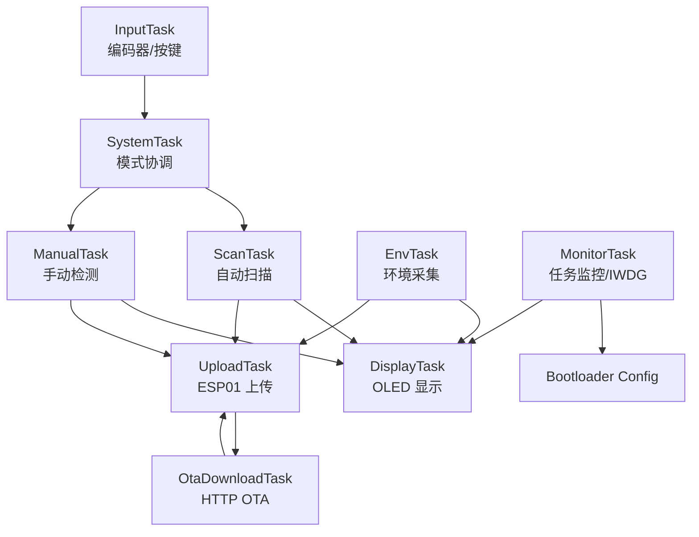

# 项目概览

## 项目简介

`STM32_Monitor` 是一个基于 STM32F103ZE 和 FreeRTOS 的多传感器环境监测与人员检测系统。

项目将环境采集、自动扫描、手动方向控制、OLED 显示、ESP01 上传、应用侧 OTA 下载和任务监控拆分为多个 FreeRTOS 任务，通过任务通知、队列、互斥锁和任务心跳实现协作。当前版本已接入 Bootloader A/B 双槽 OTA，并完成原接线下的业务任务共存和压力回归。

## 实现功能

| 功能 | 说明 |
| --- | --- |
| 环境采集 | 周期读取 DHT11 温湿度和光敏模块状态。 |
| 自动扫描 | 舵机按多个角度扫描，读取 HC-SR04 距离和 AMG8833 热阵列摘要。 |
| 手动控制 | 旋转编码器控制舵机角度，并读取当前方向检测结果。 |
| OLED 显示 | 显示自动扫描、手动控制、上传状态和任务监控页面。 |
| Wi-Fi/TCP 上传 | ESP01 通过 AT 指令连接 Wi-Fi 和 TCP 服务端，上传当前系统数据。 |
| 应用侧 OTA | PC 端服务程序可通过 `PATH/VER` 命令触发 ESP01 HTTP OTA 下载到非活动槽位。 |
| A/B 健康确认 | 新固件启动后，`MonitorTask` 基于关键任务心跳写入 `CONFIRMED`。 |
| OTA 状态报告 | 上传报文上报 Config 状态、A/B 版本、最近一次 OTA 结果和失败原因。 |
| ESP01 接收路径优化 | USART3 使用 DMA 环形缓冲区和 IDLE 中断承接串口字节，经 RingBuffer 交由 AT 解析流程处理；已完成业务任务共存和压力回归。 |
| 任务监控 | `MonitorTask` 输出任务心跳、栈余量和堆水位。 |
| IWDG 恢复 | 由 `MonitorTask` 根据关键任务健康状态集中喂狗，异常时停止喂狗等待复位恢复。 |
| 低活动策略 | OLED 长时间无输入时降低刷新频率，ESP01 网络异常时进入退避重连。 |

## 硬件组成

| 模块 | 项目用途 |
| --- | --- |
| STM32F103ZE | 主控芯片，运行 FreeRTOS 多任务程序。 |
| DHT11 | 温湿度采集。 |
| 光敏传感器 | 环境光强状态采集。 |
| HC-SR04 | 距离检测。 |
| AMG8833 | 8x8 热阵列检测辅助。 |
| OLED SSD1306 | 本地数据显示。 |
| 舵机 | 自动扫描和手动方向控制。 |
| 旋转编码器 | 页面切换、模式切换和手动角度控制。 |
| ESP01 | Wi-Fi/TCP 上传。 |

详细连接见 [硬件连接与引脚分配](硬件连接与引脚分配.md)。

## 软件模块

| 目录 | 职责 |
| --- | --- |
| `App/` | 应用层任务、显示、上传、检测、扫描和协议封装。 |
| `BSP/` | STM32 外设基础封装，如 GPIO、USART、I2C、PWM、定时器、IWDG。 |
| `Drivers/` | 传感器和外部模块驱动，如 DHT11、HC-SR04、AMG8833、OLED、ESP01。 |
| `System/` | 延时等系统辅助模块。 |
| `User/` | `main`、中断入口和 STM32 标准库配置。 |
| `Library/` | STM32 标准外设库。 |
| `Middlewares/` | FreeRTOS 和通用中间件。 |

## 数据流概览

系统采用“模式协调 + 生产者快照 + 消费者读取”的数据流：

- `SystemTask` 负责 Auto/Manual 模式协调、任务命令和运行态发布。
- `ScanTask`、`ManualTask`、`EnvTask` 分别生产业务数据。
- `DisplayTask` 读取最新快照并刷新 OLED。
- `UploadTask` 读取最新快照和 OTA 状态报告，复制到本地副本后打包上传，并解析服务端 OTA 命令。
- `OtaDownloadTask` 独占 ESP01 执行 HTTP OTA 下载，成功后保存 `PENDING_VERIFY` 状态并复位。
- `MonitorTask` 采集任务健康状态，负责 IWDG 集中喂狗，并在 `TESTING` 状态下基于关键任务心跳确认新固件。

更多任务与通信细节见 [软件架构与任务划分](软件架构与任务划分.md)，跨任务数据结构见 [数据结构与快照说明](数据结构与快照说明.md)。
